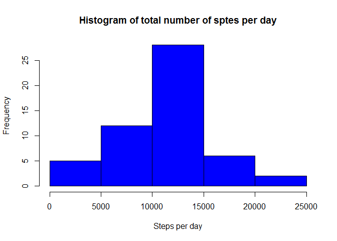

-So we start by reading our data and remove the missing values


```r
data <- read.csv("./activity_data/activity.csv",as.is = TRUE)
acts <- data[complete.cases(data),]
```

-Now we calculate the total number of steps taken per day and make a histogram 


```r
day_sums <- tapply(acts$steps,acts$date,sum)  

hist(day_sums,main = "Histogram of total number of sptes per day",xlab = "Steps per day")
```

<!-- -->

-Then we calculate the mean and the median of the total number of steps


```r
round(mean(day_sums))
```

```
## [1] 10766
```

```r
median(day_sums)
```

```
## [1] 10765
```


Next we will calculate the average number of steps taken for every interval and make a plot of the 5-minute interval (x-axis) and the average number of steps taken, averaged across all days (y-axis).Also we will find which 5-minute interval, on average across all the days in the dataset, contains the maximum number of steps


```r
int_steps <- tapply(acts$steps, acts$interval, mean)

plot(unique(acts$interval),int_steps,type = 'l',main = "Average number of steps per interval",xlab = "Intervals",ylab = "Average number of steps")
```

<!-- -->

```r
indices <- unique(data$interval)

Max_int <- indices[which.max(int_steps)]
```

-So the interval with the max number of steps is 835

-The total number of missing values in the data set is 


```r
sum(!complete.cases(data))
```

```
## [1] 2304
```

-Now we will create a new dataset that is equal to the original dataset but with the missing data filled in


```r
data1 <- data

for (i in 1:length(data1$steps)) {
        if(is.na(data1$steps[i])) {
                data1$steps[i] <- int_steps[which(indices == data1$interval[i])]
        }        
}
```

-And next we will calculate the total number of steps per day for this dataset and make a histogram  


```r
day_sums1 <- tapply(data1$steps, data1$date, sum)

hist(day_sums1,main = "Histogram of total number of steps per day(fixed)",xlab = "Steps per day")
```

<!-- -->

-Then we calculate the mean and the median of the total number of steps for this dataset


```r
round(mean(day_sums1))
```

```
## [1] 10766
```

```r
round(median(day_sums1))
```

```
## [1] 10766
```


-We can see that the mean and the median are not changed a lot when we fill in the missing values

-At last we will create a new factor variable in the dataset with two levels – “weekday” and “weekend” indicating whether a given date is a weekday or weekend day and then we will make a panel plot of the 5-minute interval (x-axis) and the average number of steps taken, averaged across all weekday days or weekend days (y-axis)


```r
dayz <- weekdays(as.Date(data1$date))
day_names <- levels(factor(dayz))
for (i in 1:length(dayz)) {
        if(dayz[i]==day_names[2] | dayz[i]==day_names[5]) {
                data1$day[i] <- "Weekend"
        } else {
                data1$day[i] <- "Weekday"
        }
}

data2 <- aggregate(steps~interval+day,data1,mean)

# now we make the plot 

library(ggplot2)
```

```
## Warning: package 'ggplot2' was built under R version 3.5.1
```

```r
myplot <- ggplot(data2,aes(interval,steps)) + geom_line(stat = "identity",aes(colour = day)) + facet_grid(day~.) + labs(x = "Interval",y = "Number of steps",title = "Average number of steps per interval by day")

print(myplot)
```

<!-- -->
